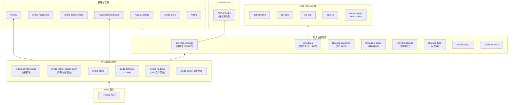
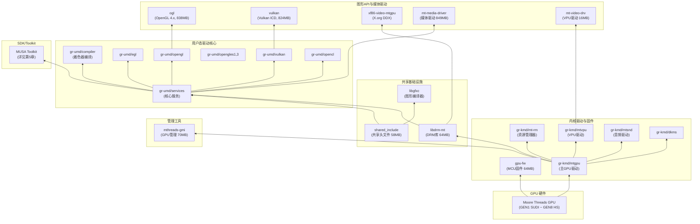
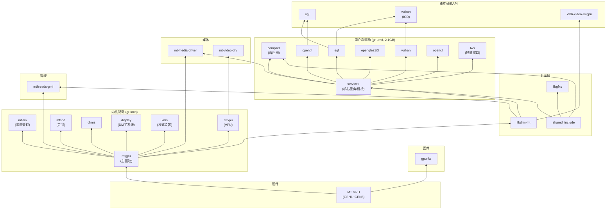
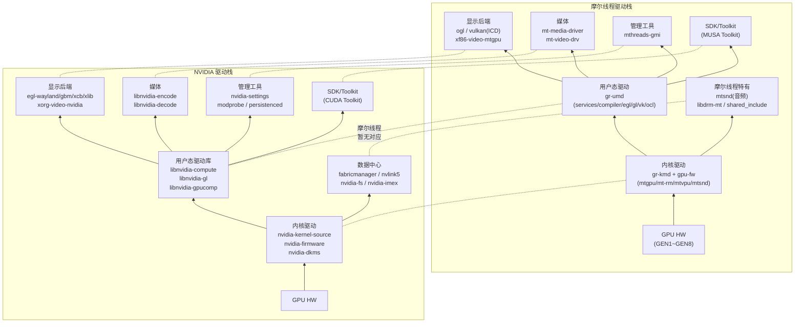
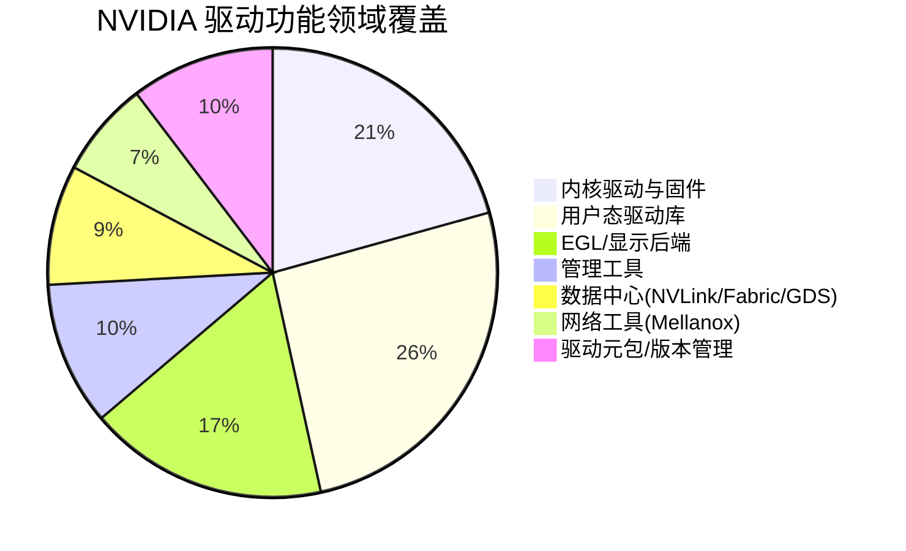
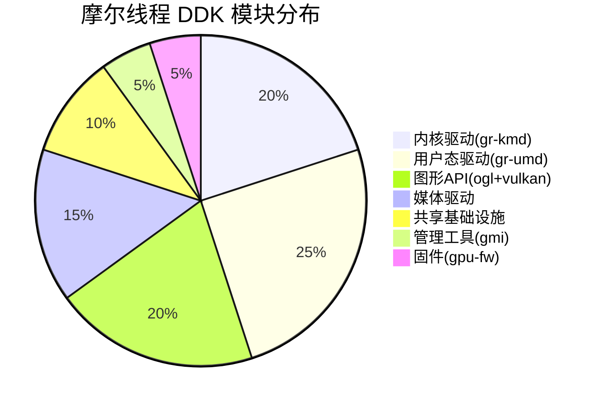

# GPU 驱动软件制品分析文档生成

你是一个GPU驱动软件生态分析专家。请按照以下流程生成一份**以驱动为核心**的软件制品对比分析文档。

## 数据源路径

- **NVIDIA 驱动+SDK 包仓库:** `/workspace/tmp/cuda_package/var/cuda-repo-ubuntu2404-13-2-local`（145 个 .deb 包）
- **摩尔线程驱动包（构建产物）:** `/workspace/tmp/musa_package`（单个 .deb + 解压后的安装内容）
- **摩尔线程驱动源码 (DDK):** `/workspace/linux-ddk`（仅用于了解模块结构，禁止看源码）
- **摩尔线程 Toolkit (SDK):** `/workspace/musa_toolkit`（仅用于 SDK 对照表）

## 分析流程

### 第一步：扫描 NVIDIA 软件包

1. 读取 `Packages` 元数据文件，提取每个包的 `Package`、`Version`、`Architecture`、`Description`、`Size` 字段
2. **使用 `dpkg-deb -I <包路径>` 查看每个 .deb 包的详细元数据**，重点提取：
   - `Depends` — 运行时依赖（用于构建包间依赖关系图）
   - `Pre-Depends` — 前置依赖
   - `Recommends` / `Suggests` — 推荐/建议依赖
   - `Conflicts` / `Replaces` / `Provides` — 冲突和替换关系
   - `Description` — 包功能描述
3. **区分驱动包和 SDK 包**：
   - 驱动包：nvidia-driver*, nvidia-kernel*, nvidia-firmware, nvidia-dkms, libnvidia-*, nvidia-fs*, nvidia-fabricmanager*, nvlink*, nvidia-imex, nvidia-modprobe, nvidia-persistenced, nvidia-settings, nvidia-xconfig, xserver-xorg-video-nvidia, libxnvctrl*, nvidia-headless*, dkms, libnvsdm*, libnvidia-nscq*, nvidia-driver-pinning-*, mft*, collectx*, nvlsm*, eglexternalplatform-dev
   - SDK 包：cuda-*, libcublas*, libcufft*, libcusparse*, libcusolver*, libcurand*, libnpp*, libnvjpeg*, libnvrtc*, libnvjitlink*, libnvvm*, libnvfatbin*, libnvptxcompiler*, libcufile*, gds-tools*, nsight-*, libcuobjclient*
4. 对驱动包进行详细功能分类
5. **基于 Depends 字段构建 NVIDIA 驱动包间的依赖关系图**，用于第 3 章的 Mermaid 依赖图绘制

### 第二步：扫描摩尔线程 DDK 源码仓库

> **重要：禁止阅读摩尔线程仓库的源代码文件（.c/.h/.cpp 等）。**
> 允许读取的文件类型：
> - 目录结构（ls、Glob 列出目录和文件名）
> - README.md / RELEASE.md / CHANGELOG 等文档
> - CMakeLists.txt / Makefile / configure.ac 等构建配置文件
> - 构建相关脚本（ddk_build.sh、install.sh、*.py 构建脚本如 genOglBuild.py、cmake_mtvulkan.py 等）
> - .gitmodules / .ciConfig.yaml 等项目配置
>
> **禁止读取**的文件：.c / .h / .cpp / .cc / .cxx 等源代码文件

1. 遍历 `/workspace/linux-ddk` 下所有顶层子模块目录
2. 通过目录名、README 和构建配置文件识别模块功能
3. 通过顶层 CMakeLists.txt / Makefile / 构建脚本识别构建系统和模块依赖
4. 梳理模块间依赖关系
5. **递归查找子模块的子模块**：如果某个 NVIDIA .deb 包在顶层模块中找不到对应，需递归检查子模块内部的 `.gitmodules`，逐层深入查找。例如 `gr-umd/external/submodules/` 下可能包含 mesa、mtcc、xorg-server 等嵌套子模块，它们可能是某些 NVIDIA 包的真正对应点。对每一级子模块同样通过目录结构、README、构建配置来识别功能。

### 第三步：验证构建产物（辅助）

浏览 `/workspace/tmp/musa_package`（linux-ddk 构建产出的解压内容），用于：
- 验证 DDK 源码模块的实际构建产物（哪个模块产出哪些 .so / 固件 / 配置文件）
- 获取产物文件名和大小作为补充信息
- 使用 `dpkg-deb -I /workspace/tmp/musa_package/musa_*.deb` 查看摩尔线程驱动包的元数据（Depends、Conflicts、Replaces 等），与 NVIDIA 的包依赖进行对比
- **不作为对照表的主体**，仅用于辅助验证和补充说明

### 第四步：快速扫描摩尔线程 Toolkit

> **同样禁止阅读源代码文件。** 仅通过目录结构、README、构建配置文件和构建脚本识别组件。

1. 遍历 `/workspace/musa_toolkit` 下所有顶层目录
2. 仅需识别组件名称和功能定位，不需要深入分析

### 第五步：生成文档

输出到 `$ARGUMENTS`，如未指定则输出到 `/workspace/tmp/artifact-analysis-report.md`。

---

## 文档模板

请严格按照以下结构生成文档：

```markdown
# GPU 驱动软件制品对比分析报告

> 生成日期: YYYY-MM-DD
> NVIDIA 驱动版本: (从包名提取)
> NVIDIA CUDA 版本: (从包名提取)
> 摩尔线程驱动包版本: (从 musa_*.deb 包名提取)
> 摩尔线程 DKMS 内核模块版本: (从 dkms.conf 提取)
> 摩尔线程 MUSA Toolkit 版本: (从 musa_toolkit 提取)

---

## 1. 概述

简要说明分析范围和两个生态的整体差异：
- 本报告**聚焦驱动层**制品分析，SDK/Toolkit 部分仅列出对应关系
- NVIDIA：将驱动拆分为 ~55 个独立 .deb 包（按功能细粒度拆分），与 SDK 一起放在本地 APT 仓库中
- 摩尔线程：将所有驱动组件打包为**一个统一 .deb 包**（musa_*.deb, ~266MB），安装后展开为固件、内核模块源码、用户态库、工具、配置文件等
- 摩尔线程驱动源码在 linux-ddk 仓库（~15 个子模块），SDK 在 musa_toolkit 仓库（独立维护）

## 2. 驱动制品分类对照表

> **对照核心：NVIDIA .deb 包 ←→ linux-ddk 源码模块**
> - 左列：NVIDIA 仓库中的独立 .deb 驱动包
> - 右列：摩尔线程 `/workspace/linux-ddk` 中的源码子模块
> - 可通过 `/workspace/tmp/musa_package` 中的构建产物验证模块的实际产出文件

### 2.1 内核驱动与固件

| 功能领域 | NVIDIA 制品（.deb 包） | 摩尔线程 DDK 模块 | 对应状态 | 说明 |
|---------|----------------------|-----------------|---------|------|
| 内核模块源码 | nvidia-kernel-source (78MB) | gr-kmd/mtgpu (906MB 源码) | 有对应 | ... |
| 开源内核模块 | nvidia-kernel-source-open (8MB) | 无（MT 不区分开源/闭源内核模块） | 无对应 | NVIDIA 双轨策略，MT 为混合模式 |
| DKMS 封装 | nvidia-dkms, nvidia-dkms-open | gr-kmd/dkms | 有对应 | ... |
| 内核公共模块 | nvidia-kernel-common (741KB) | gr-kmd (含在同一模块中) | 有对应 | ... |
| GPU 固件 | nvidia-firmware (73MB) | gpu-fw (64MB 源码) | 有对应 | MT 按代际编译独立固件 gen1~gen8 |
| 资源管理器 | (包含在内核模块中) | gr-kmd/mt-rm (基于 PowerVR) | 有对应 | MT 独立子模块，NVIDIA 内嵌 |
| VPU 内核驱动 | (不单独提供) | gr-kmd/mtvpu | 有（MT额外） | 摩尔线程独立视频处理单元驱动 |
| 音频内核驱动 | (不包含) | gr-kmd/mtsnd | 有（MT额外） | 摩尔线程 GPU 音频输出 |
| 显示管理子系统 | (包含在内核模块中) | gr-kmd/mtgpu/display + kms | 有对应 | MT 独立子目录 |
| 下一代内核驱动 | (不适用) | gr-kmd/mtgpu-next (开发中) | 有（MT额外） | ... |
| 驱动元包 | nvidia-driver, nvidia-driver-open, nvidia-drivers, nvidia-open (4 个) | 无（单包构建，无元包概念） | 无对应 | NVIDIA 包管理层级特有 |
| 无头模式驱动 | nvidia-headless* (4 个变体) | 无 | 无对应 | ... |

### 2.2 用户态驱动

| 功能领域 | NVIDIA 制品（.deb 包） | 摩尔线程 DDK 模块 | 对应状态 | 说明 |
|---------|----------------------|-----------------|---------|------|
| 计算驱动库 | libnvidia-compute (amd64:80MB, i386:35MB) | gr-umd/services | 有对应 | ... |
| GPU 编译支持 | libnvidia-gpucomp (amd64:24MB, i386:27MB) | gr-umd/compiler + libgfxc | 有对应 | ... |
| OpenGL 驱动 | libnvidia-gl (amd64:113MB, i386:19MB) | gr-umd/opengl + ogl (838MB 源码) | 有对应 | ... |
| OpenGL ES | (包含在 libnvidia-gl 中) | gr-umd/opengles1 + gr-umd/opengles3 | 有对应 | ... |
| Vulkan 驱动 | (包含在 libnvidia-gl 中) | vulkan (824MB 源码, ICD 驱动) | 有对应 | ... |
| EGL Wayland | libnvidia-egl-wayland21 (amd64/i386) | gr-umd/egl | 有对应 | NVIDIA 按后端拆包，MT 统一模块 |
| EGL GBM | libnvidia-egl-gbm1 (amd64/i386) | gr-umd/egl | 有对应 | 同上 |
| EGL XCB | libnvidia-egl-xcb1 (amd64/i386) | gr-umd/egl | 有对应 | 同上 |
| EGL Xlib | libnvidia-egl-xlib1 (amd64/i386) | gr-umd/egl | 有对应 | 同上 |
| OpenCL | (包含在 SDK 中: cuda-opencl) | gr-umd/opencl | 有对应 | ... |
| 视频编码 | libnvidia-encode (amd64/i386) | mt-media-driver (849MB 源码) | 有对应 | ... |
| 视频解码 | libnvidia-decode (amd64:2.6MB, i386:2.4MB) | mt-media-driver + mt-video-drv (16MB) | 有对应 | MT 拆为媒体驱动 + VPU 驱动 |
| DRM 库 | (使用系统 libdrm) | libdrm-mt (64MB，定制 DRM 分支) | 有（MT额外） | MT 自维护 DRM 库 |
| 共享头文件 | (各包自含) | shared_include (58MB) | 有（MT额外） | 跨模块共享定义 |
| 轻量窗口系统 | (不单独提供) | gr-umd/lws | 有（MT额外） | ... |
| 2D 图形引擎 | (不单独提供) | gr-umd/rogue2d (PowerVR) | 有（MT额外） | ... |
| KMD-UMD 桥接 | (不单独提供) | gr-umd/services/bridge | 有（MT额外） | ... |
| 帧缓冲捕获 | libnvidia-fbc1 (amd64/i386) | 无 | 无对应 | ... |
| 配置库 | libnvidia-cfg1 (146KB) | 无 | 无对应 | ... |
| 公共数据 | libnvidia-common (27KB) | 无 | 无对应 | ... |
| 扩展库 | libnvidia-extra (amd64/i386) | 无 | 无对应 | ... |
| NSCQ 库 | libnvidia-nscq (428KB) | 无 | 无对应 | ... |
| SDM 库 | libnvsdm, libnvsdm-dev | 无 | 无对应 | ... |

### 2.3 显示与 X Window

| 功能领域 | NVIDIA 制品（.deb 包） | 摩尔线程 DDK 模块 | 对应状态 | 说明 |
|---------|----------------------|-----------------|---------|------|
| X.org 视频驱动 | xserver-xorg-video-nvidia | xf86-video-mtgpu (1.4MB, Autotools) | 有对应 | ... |
| X 控制库 | libxnvctrl0, libxnvctrl-dev | 无 | 无对应 | ... |
| EGL 外部平台 | eglexternalplatform-dev | 无 | 无对应 | ... |

### 2.4 驱动管理与工具

| 功能领域 | NVIDIA 制品（.deb 包） | 摩尔线程 DDK 模块 | 对应状态 | 说明 |
|---------|----------------------|-----------------|---------|------|
| GPU 管理接口 | nvidia-settings (883KB) | mthreads-gmi (70MB, 支持多架构) | 有对应 | MT 的 gmi 对标 nvidia-smi + settings |
| 设备节点管理 | nvidia-modprobe (46KB) | 无 | 无对应 | ... |
| 持久化守护进程 | nvidia-persistenced (81KB) | 无 | 无对应 | ... |
| X 配置生成 | nvidia-xconfig (261KB) | 无 | 无对应 | ... |
| 驱动助手 | nvidia-driver-assistant | 无 | 无对应 | ... |
| 驱动版本锁定 | nvidia-driver-pinning-* (2 个) | 无 | 无对应 | ... |

### 2.5 GPU 互联与数据中心

| 功能领域 | NVIDIA 制品（.deb 包） | 摩尔线程 DDK 模块 | 对应状态 | 说明 |
|---------|----------------------|-----------------|---------|------|
| GPU 互联 | nvlink5 (2.8MB) | 无 | 无对应 | ... |
| IMEX 通信 | nvidia-imex (8.4MB) | 无 | 无对应 | ... |
| Fabric 管理 | nvidia-fabricmanager + dev (9.4MB) | 无 | 无对应 | ... |
| GPU 文件系统 | nvidia-fs, nvidia-fs-dkms | 无 | 无对应 | ... |
| 系统监控 | nvlsm (10MB) | 无 | 无对应 | ... |

### 2.6 网络与固件工具

| 功能领域 | NVIDIA 制品（.deb 包） | 摩尔线程 DDK 模块 | 对应状态 | 说明 |
|---------|----------------------|-----------------|---------|------|
| Mellanox 固件工具 | mft (46MB) | 无 | 无对应 | NVIDIA 收购 Mellanox 后集成 |
| MFT 自动补全 | mft-autocomplete | 无 | 无对应 | ... |
| MFT OEM 工具 | mft-oem (3MB) | 无 | 无对应 | ... |
| 遥测诊断 | collectx-bringup (140MB) | 无 | 无对应 | ... |

## 3. 驱动分层架构与依赖关系图

使用 Mermaid 绘制两家公司**驱动层**软件制品的分层架构图和模块依赖图。
注意：仅绘制驱动相关的包/模块，SDK/Toolkit 层仅作为最上方的一个汇总方框标注"SDK/Toolkit（详见第5章）"。

### 3.1 NVIDIA 驱动栈分层架构图

绘制 NVIDIA 驱动栈自下而上的分层架构，使用 `graph BT` 格式：



> **绘图要求：**
> - 仅展示驱动层相关的包，SDK 层只用一个方框代表
> - 每个包标注名称和大小（对于大包）
> - 用 subgraph 分层，层名清晰
> - 注意展示 amd64/i386 双架构包的标注

### 3.2 摩尔线程驱动栈分层架构图

绘制摩尔线程 DDK 自下而上的分层架构：



### 3.3 驱动模块依赖关系图

分别绘制两家的**驱动模块间具体依赖关系图**，使用 `graph BT` 格式。

#### 3.3.1 NVIDIA 驱动包依赖关系图

```mermaid
graph BT
    subgraph HW["硬件"]
        GPU["NVIDIA GPU"]
    end

    subgraph Kernel["内核层"]
        ksrc["nvidia-kernel-source"]
        ksrc-open["nvidia-kernel-source-open"]
        fw["nvidia-firmware"]
        dkms["nvidia-dkms"]
        dkms-open["nvidia-dkms-open"]
        kcommon["nvidia-kernel-common"]
        fs-dkms["nvidia-fs-dkms"]
        ksrc --> dkms
        ksrc-open --> dkms-open
        kcommon --> dkms & dkms-open
    end

    subgraph UserLib["用户态库"]
        compute["libnvidia-compute"]
        gl["libnvidia-gl"]
        gpucomp["libnvidia-gpucomp"]
        encode["libnvidia-encode"]
        decode["libnvidia-decode"]
        fbc["libnvidia-fbc1"]
        cfg["libnvidia-cfg1"]
        nscq["libnvidia-nscq"]
        sdm["libnvsdm"]
    end

    subgraph Display["显示"]
        egl-wl["egl-wayland"]
        egl-gbm["egl-gbm"]
        egl-xcb["egl-xcb"]
        egl-xlib["egl-xlib"]
        xorg["xorg-video-nvidia"]
        xnvctrl["libxnvctrl"]
    end

    subgraph Mgmt["管理与互联"]
        settings["nvidia-settings"]
        modprobe["nvidia-modprobe"]
        persist["nvidia-persistenced"]
        xconfig["nvidia-xconfig"]
        fabric["fabricmanager"]
        nvlink["nvlink5"]
        imex["nvidia-imex"]
        fs["nvidia-fs"]
    end

    subgraph Meta["驱动元包"]
        driver["nvidia-driver"]
        headless["nvidia-headless"]
    end

    %% 依赖关系
    GPU --> ksrc & fw
    ksrc --> compute & gl & gpucomp
    compute --> encode & decode
    gl --> egl-wl & egl-gbm & egl-xcb & egl-xlib & xorg
    cfg --> settings & xconfig
    gl --> fbc
    compute --> nscq & sdm
    dkms --> driver
    compute & gl --> driver
    compute --> headless
    fs-dkms --> fs
    ksrc --> fabric & nvlink & imex
    xorg --> xnvctrl
```



#### 3.3.2 摩尔线程驱动模块依赖关系图



### 3.4 双栈驱动架构并列对比

绘制一张**并列对比图**，左侧 NVIDIA 驱动栈，右侧摩尔线程驱动栈，同层对齐，虚线连接对应关系：



> **绘图要求：**
> - 左右两栈同层对齐，聚焦驱动层
> - 虚线标注对应关系
> - NVIDIA 有但摩尔线程无的（数据中心功能）和摩尔线程有但 NVIDIA 无的（音频、多架构）需特别标注

## 4. 驱动差异分析

### 4.1 驱动功能覆盖度对比

用 Mermaid 饼图展示两家驱动的功能领域覆盖情况：





> 实际生成时根据扫描结果填入准确数据，数值可以用包/模块数量或体积占比。

### 4.2 NVIDIA 驱动能力而摩尔线程缺少的

按重要程度分类列出：

**关键缺失**（影响基础功能）：
- （逐项列出并说明影响）

**重要缺失**（影响数据中心/企业场景）：
- （逐项列出）

**次要缺失**（NVIDIA 生态特有或锦上添花）：
- （逐项列出）

### 4.3 摩尔线程驱动具备而 NVIDIA 该仓库未包含的

- （逐项列出，如：音频驱动、DRM 定制分支、多架构支持等）

### 4.4 驱动架构差异小结

从以下维度对比驱动层差异：

| 维度 | NVIDIA | 摩尔线程 |
|------|--------|---------|
| 打包策略 | ~55 个独立驱动 .deb 包，按功能细粒度拆分 | 1 个统一 .deb 包（musa_*.deb ~266MB），所有驱动组件合一 |
| 安装体积 | 各包独立，可选装 | 安装后展开 ~2.3GB |
| 依赖管理 | APT 依赖解析，包间依赖关系明确 | 仅依赖 libdrm2 + dkms，内部组件无独立依赖声明 |
| 发布形式 | 预编译 .deb（闭源二进制） | 源码编译产出 .deb（部分闭源预编译 .o_binary + 开源 wrapper） |
| 内核驱动方式 | 闭源 + 开源双轨（nvidia-kernel-source / -open） | 混合模式（开源 wrapper + 预编译核心 mtgpu.core.o_binary） |
| 用户态驱动粒度 | 按功能拆分独立 .deb（compute/gl/encode/decode/egl 各自独立） | 所有 .so 打入同一包，安装到 /usr/lib/x86_64-linux-gnu/ |
| 显示后端 | 4 种 EGL 后端 × 2 架构 = 8 个独立包 | 统一 libEGL_mtgpu.so + libmusa_mesa_wsi.so |
| DRI 驱动 | 不使用 Mesa DRI 架构 | 基于 Mesa DRI (mtgpu_dri.so 268MB, musa_dri.so 65MB) |
| 媒体驱动 | 编码/解码以用户态库包形式提供 | 独立 mt-media-driver + mt-video-drv，含多代 drv_video .so |
| 多架构支持 | amd64 + i386 兼容 | 源码支持 x86_64/aarch64/armhf/loongarch64/sw64，包仅提供 amd64 |
| 数据中心功能 | Fabric/NVLink/GDS/IMEX 完整支持 | 暂无 |
| GPU 音频 | 不包含 | 包含 ALSA UCM 配置（Gen1/2/3） |
| 固件管理 | nvidia-firmware 单一包 (73MB) | 按代际独立固件 mtfw-gen*.bin (29MB)，含 VPU/调试字典 |
| 硬件代际 | 单一驱动版本统一支持 | GEN1~GEN8 多代，固件/配置按代区分 |
| IP 来源标记 | 纯 NVIDIA 自研 | 包含 PowerVR/Imagination Tech 组件 (libsrv_um, librogue2d 等) |

## 5. SDK/Toolkit 对应关系

> 本章不做深入分析，仅列出两家 SDK 包的对应关系。

### 5.1 SDK 包对照表

| 功能领域 | NVIDIA 包 (CUDA Toolkit) | 摩尔线程包 (MUSA Toolkit) | 对应状态 |
|---------|------------------------|------------------------|---------|
| 计算运行时 | cuda-cudart | MUSA-Runtime | 有对应 |
| 编译器 | cuda-nvcc, cuda-crt | mtcc (LLVM-based) | 有对应 |
| 运行时编译 | libnvrtc | libmtrtc (mtcc 内) | 有对应 |
| JIT 链接 | libnvjitlink | ... | ... |
| PTX 编译 | libnvptxcompiler | ... | ... |
| Fat Binary | libnvfatbin | ... | ... |
| 虚拟机 | libnvvm | ... | ... |
| 线性代数 | libcublas | muBLAS | 有对应 |
| 轻量 BLAS | (libcublasLt 含在 cublas 中) | muBLASLt | 有对应 |
| FFT | libcufft | muFFT | 有对应 |
| 稀疏矩阵 | libcusparse | muSPARSE | 有对应 |
| 随机数 | libcurand | muRAND | 有对应 |
| 线性求解 | libcusolver | muSOLVER | 有对应 |
| 图像处理 | libnpp | muPP | 有对应 |
| JPEG 处理 | libnvjpeg | mtjpeg | 有对应 |
| 性能分析接口 | cuda-cupti | MUPTI | 有对应 |
| 调试器 | cuda-gdb | ... | ... |
| 内核分析 | nsight-compute | ... | ... |
| 系统分析 | nsight-systems | ... | ... |
| 内存检测 | cuda-sanitizer | ... | ... |
| 标注库 | cuda-nvtx | ... | ... |
| 算法库 | cuda-cccl (Thrust/CUB) | muAlg + muThrust | 有对应 |
| OpenCL | cuda-opencl | gr-umd/opencl | 有对应 |
| GPU 直连存储 | libcufile, gds-tools | 无 | 无对应 |
| NVML 管理库 | cuda-nvml-dev | mthreads-gmi | 有对应 |
| 反汇编 | cuda-nvdisasm, cuda-cuobjdump | ... | ... |
| 代码剪枝 | cuda-nvprune | ... | ... |
| 代码迁移工具 | (不含) | musify | 有（MT额外） |
| 图形编译器 | (不含) | libgfxc (Vulkan/GL/D3D12) | 有（MT额外） |
| CUDA 兼容层 | (不需要) | zluda (规划中) | 规划中 |
| OS 抽象层 | cuda-culibos | ... | ... |
| 沙箱开发 | cuda-sandbox-dev | ... | ... |
| 文档 | cuda-documentation | ... | ... |

### 5.2 SDK 差异要点

用 3~5 个要点概括两家 SDK 的关键差异，不需要展开分析。

## 6. 驱动制品完整清单

### 6.1 NVIDIA 驱动包清单

仅列出**驱动类**包（排除 SDK/Toolkit 包）：

| 序号 | 包名 | 版本 | 架构 | 大小 | 分类 |
|------|------|------|------|------|------|
| (从 Packages 文件提取驱动包数据填充) |

### 6.2 NVIDIA SDK 包清单

仅列出**SDK 类**包（精简列出，不展开分析）：

| 序号 | 包名 | 版本 | 大小 | 分类 |
|------|------|------|------|------|
| (精简列出) |

### 6.3 摩尔线程 DDK 模块清单

| 序号 | 模块名 | 构建系统 | 源码大小 | 主要功能 | 构建产物（从 musa_package 验证） | NVIDIA 驱动包对应 |
|------|--------|---------|---------|---------|-------------------------------|-----------------|
| (逐模块填写，构建产物列填入对应的 .so / 固件 / 工具文件名作为辅助参考) |

### 6.4 摩尔线程 Toolkit 模块清单

| 序号 | 模块名 | 构建系统 | 主要功能 | NVIDIA SDK 包对应 |
|------|--------|---------|---------|-----------------|
```

## 图表与可视化要求

**全文尽量多用图表来生动展示信息**，具体要求：

1. **Mermaid 图**：
   - 统一使用 `graph BT` 格式（自下而上）
   - **节点内换行一律使用 `<br>`，禁止使用 `\n`**（`\n` 在很多渲染器中不生效会显示为乱码）
   - 分层架构图中 SDK 层仅作为顶部一个汇总方框，不展开
   - 适合使用 Mermaid 图的场景：分层架构、依赖关系、对比视图、流程图

2. **适合用 Mermaid 饼图/象限图的场景**：
   - 差异分析中的覆盖度对比（如：NVIDIA 有 X 个功能领域，MT 覆盖了 Y 个）→ 用 `pie` 图
   - 各模块/包的体积占比 → 用 `pie` 图
   - 功能成熟度象限评估 → 用 `quadrantChart`

3. **表格**用于逐项对照，图表用于全局概览，两者配合使用

4. **文字描述尽量精简**，能用图表表达的不要用大段文字

## 注意事项

1. 所有 `...` 占位符必须替换为实际分析内容
2. **驱动部分**是文档核心，需要逐包/逐模块详细分析
3. **SDK/Toolkit 部分**（第5章）仅列对照表和要点，不展开分析
4. "对应状态"列使用：`有对应` / `部分对应` / `无对应` / `有（MT额外）` / `规划中`
5. 包大小使用人类可读格式（KB/MB/GB）
6. 读取 NVIDIA 的 Packages 文件获取准确描述信息
7. 读取摩尔线程的 README.md 和构建配置文件获取功能描述（**禁止读取 .c/.h/.cpp 源代码**，允许读取构建相关 .py 脚本）
8. 对照表核心是 **NVIDIA .deb 包 vs linux-ddk 源码模块**，`/workspace/tmp/musa_package` 仅用于辅助验证模块的实际构建产物
