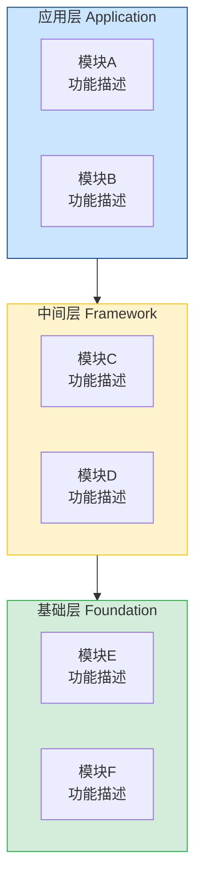
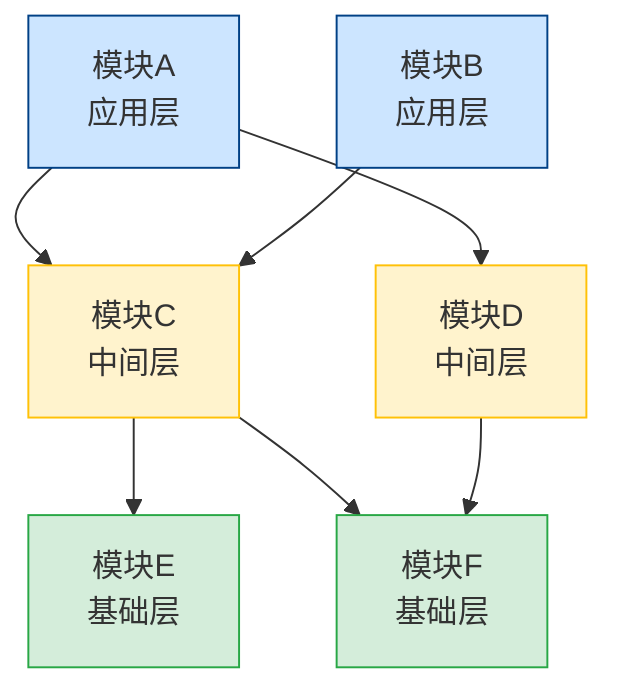
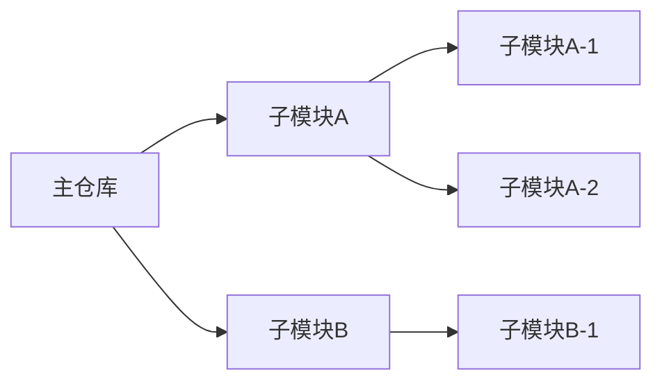

# 仓库架构深度分析 + 文档生成

对目标仓库（含所有嵌套子模块）进行完整架构分析，最终生成一份 Markdown 格式的仓库介绍文档，构建图使用 Mermaid。

## 分析目标

目标路径：$ARGUMENTS（未指定则使用当前目录）

输出文件：`<仓库根目录>/ARCHITECTURE.md`

---

## 第一步：摸清整体轮廓

从顶层快速建立全局认知，按优先级收集：

1. 顶层 README（`README.md` / `README.rst` / `README`）——最重要，先读完
2. `.gitmodules` —— 获取所有子模块路径和 URL，这是后续分析的地图
3. 顶层目录列表 —— 感知整体布局
4. 顶层构建/配置文件（`CMakeLists.txt` / `Makefile` / `package.json` / `Cargo.toml` / `setup.py` / `pyproject.toml` 等）——了解项目类型、构建入口、顶层依赖
5. `docs/` 或 `doc/` 目录下的架构文档（若存在）

**目标**：先弄清楚整个仓库是什么（一个库？一个系统？一个工具链？），子模块大致分几类。

---

## 第二步：逐个分析每个子模块（含嵌套）

对 `.gitmodules` 中每一个子模块，递归处理（包括子模块的子模块），每个子模块按顺序收集：

1. **读 README** —— 最直接的功能说明
2. **看顶层目录结构** —— 判断是库 / 服务 / 工具 / 配置集
3. **读核心构建配置** —— `CMakeLists.txt` / `package.json` / `Cargo.toml` 等，重点提取：
   - 模块名称（name 字段）
   - 对外暴露的 targets / exports / packages
   - 内部依赖（`find_package` / `add_subdirectory` / `dependencies` 字段中是否引用了项目内其他模块）
4. **看源码入口的文件名** —— `src/` / `lib/` / `include/` 顶层，文件名即功能
5. **检查该子模块自己的 `.gitmodules`** —— 递归分析嵌套子模块

**每个子模块需要回答：**
- 它解决什么问题？（一句话）
- 它在整个系统里属于哪一层？（基础 / 中间 / 应用）
- 它依赖哪些其他模块？被哪些模块依赖？

---

## 第三步：整理依赖关系，确定分层

整合所有子模块的依赖信息，建立完整的依赖图谱：

- **基础层**：被多个模块依赖，自身不依赖项目内其他模块
- **中间层**：既依赖基础层，又被上层模块使用
- **应用层**：最终产物（可执行程序、服务、命令行工具）
- **工具/基础设施**：测试框架、构建辅助、公共脚本等横切关注点

---

## 第四步：生成 ARCHITECTURE.md

分析完成后，将结果写入 `ARCHITECTURE.md` 文件。文件结构如下：

````markdown
# 项目名称 架构文档

> 简短的项目定位描述（一两句话）

## 目录

- [项目概览](#项目概览)
- [架构分层](#架构分层)
- [模块依赖图](#模块依赖图)
- [各模块详解](#各模块详解)
  - [基础层](#基础层)
  - [中间层](#中间层)
  - [应用层](#应用层)
- [关键设计决策](#关键设计决策)

---

## 项目概览

| 项目 | 内容 |
|------|------|
| **项目类型** | 硬件驱动框架 / 编译工具链 / 微服务系统 / ... |
| **主要语言** | C++ / Python / Rust / ... |
| **构建系统** | CMake / Cargo / npm / ... |
| **子模块数量** | N 个（最大嵌套深度 D 层） |
| **代码仓库** | 主仓库 URL |

项目的详细背景和用途描述……

---

## 架构分层



---

## 模块依赖图

> 箭头方向表示依赖关系：`A --> B` 表示 A 依赖 B



**图例**：
- 🟢 绿色：基础层（Foundation）
- 🟡 黄色：中间层（Framework）
- 🔵 蓝色：应用层（Application）

---

## 各模块详解

### 基础层

#### `子模块路径` — 模块名称

> 一句话说清楚它是干什么的

**功能职责**：
- 具体负责哪些事情（分点）

**对外接口**：
- 暴露的头文件 / API / 命令 / 服务端口

**被以下模块依赖**：`模块C`、`模块D`

**嵌套子模块**（若有）：

| 子模块 | 用途 |
|--------|------|
| `nested/moduleX` | 功能说明 |

---

（中间层、应用层各模块同样格式）

---

## 关键设计决策

- **为什么拆分成这些子模块**：物理隔离 / 独立版本管理 / 跨项目复用 / ...
- **模块间解耦方式**：接口约定 / 抽象层 / 事件总线 / ...
- **特别的架构模式**：插件化 / 分层架构 / 微内核 / ...

---

## 注意事项

（可选）文档缺失的模块、依赖关系不明确的地方、已知的技术债务……

---

````

---

## Mermaid 图规范

### ⚠️ 已知限制（必须遵守）

- **禁止在节点标签中使用 `\n`**，换行统一用 `<br/>`：`["模块名<br/>功能描述"]`
- **节点 ID 不能含空格**，多词用驼峰或下划线：`osAbstraction` / `os_abstraction`
- **架构分层图用 `graph TD` + `subgraph`**，不要用 `block-beta`（在部分渲染器中不稳定）

### 架构分层图（graph TD + subgraph）

- 每层用 `subgraph LAYER_ID["层名称"]` 包裹，`end` 结束
- 层间加虚箭头 `APP --> MID --> BASE` 表示上下层关系
- 用 `style` 给每个 subgraph 着色：
  - 应用层：`fill:#cce5ff,stroke:#004085`（蓝）
  - 中间层：`fill:#fff3cd,stroke:#ffc107`（黄）
  - 基础层：`fill:#d4edda,stroke:#28a745`（绿）

### 模块依赖图（graph TD）

- 使用 `graph TD`（从上到下）
- 节点 ID 用模块短名称，标签用 `["模块名<br/>层级"]`
- 箭头 `-->` 表示依赖（A --> B = A 依赖 B）
- 用 `style` 给节点按层着色（同上色方案）
- 若模块较多（>10），用 `subgraph` 按层分组

### 嵌套子模块关系（若复杂）

若嵌套结构复杂，单独增加一张子模块树形图：



---

## 分析原则

- **以 README 和配置文件为主**，不逐行读源码
- **文件名/目录名本身就是信息**，善用目录结构推断职责
- **不确定的地方标注**"根据目录结构推测"
- **嵌套子模块递归分析**，不能只看第一层
- **最终必须写入文件**：分析完成后将文档写入 `ARCHITECTURE.md`，不只是在对话中输出
